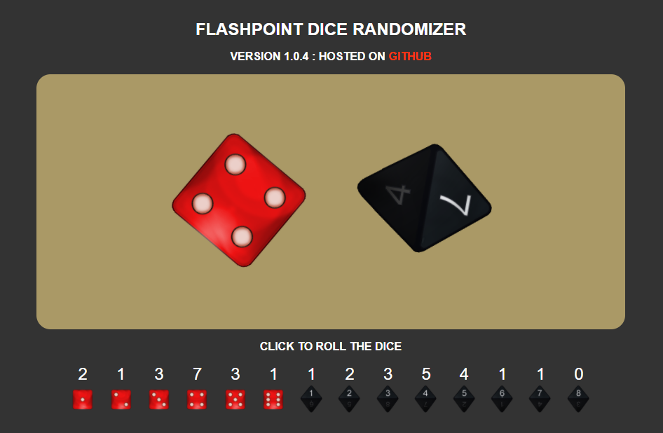

# Flashpoint Dice Randomizer

A browser based visual dice roller that rolls a **1d6** and **1d8** together; for use with the boardgame [Flash Point: Fire Rescue](http://www.indieboardsandcards.com/fpfr.php).

Short link for remebering: http://bit.do/flashpoint

QR code for mobile:

Or click on the image to open the randomizer:

## About Flash Point: Fire Rescue

From Indie Boards & Cards:
>Flash Point: Fire Rescue is a fully cooperative game, everyone plays on the same firefighting team - win or lose together!   Every turn is filled with the tension of having to fight the fire back, rescuing victims or investigating points of interest.  Players can ride the ambulance to safety or fire the engine's deck gun in a desperate attempt to control the blaze.

## Dice rolls

After players take actions for their turn, they are required to roll a Red D6 and a Black D8 together to *Advance the fire* by placing smoke tokens onto the board based on grid coordinates that correspond to these dice; If then there are less than 3 Points of Interest (POIs) on the board, then the two dice are rolled again to place a new POI onto the board.

Rolling the dice is a core mechanic, and can often be rushed, leading to dice to be rolled in the same area causing *explosions* when smoke is placed ontop of fire.

This dice randomizer aims to provide a consistent, quick, dice rolling mechanic that players can use to move the game ahead. This app can either be used as an aid, a replacement, or not at all.

## Feedback

If you have any feedback, or have problems running the randomiser (*it does nothing? no dice visible?*) please report an issue on this project.
